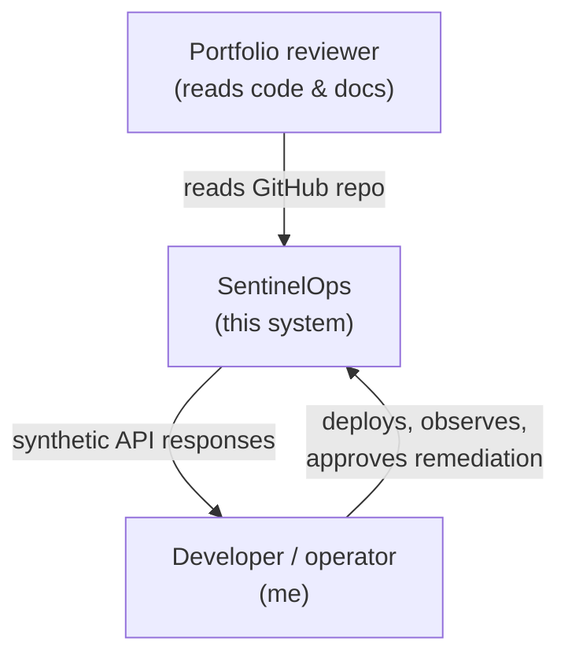
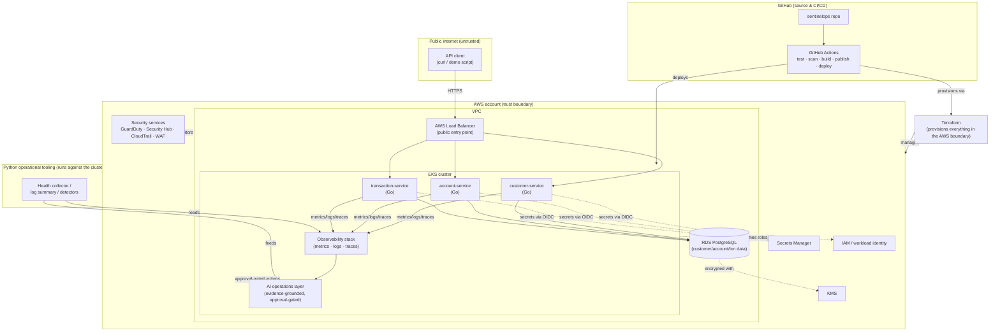

# SentinelOps — Context & Container Architecture

This is the C4-style context and container view of SentinelOps: who uses it, what runs where, and which boundaries matter. It intentionally stays at this level — service internals are documented per-service as they're built, not here. See [`project-charter.md`](../project-charter.md) for scope and principles.

## Context: who uses the system

- **Portfolio reviewer / interviewer** — reads the code and docs, does not call the API directly.
- **Developer (me)** — the only human operator: deploys, observes, and remediates via CLI, kubectl, and the AI operations layer.
- **SentinelOps API** — the single entry point external callers reach. No other component is internet-facing.

## Container view: what runs where

Trust boundaries are drawn as subgraphs. Nothing inside the AWS account boundary is reachable except through the marked entry point.

## Components

| Component | Responsibility | Notes |
|---|---|---|
| `customer-service`, `account-service`, `transaction-service` | Own their domain's data and REST API | Go, one PostgreSQL schema each, stateless |
| RDS PostgreSQL | Durable storage | Single instance; encrypted at rest via KMS |
| AWS Load Balancer | Sole public entry point | Fronts all three services; TLS terminates here |
| EKS cluster | Runs all workloads | Namespaced, RBAC + network-policy isolated |
| Observability stack | Metrics, logs, traces, SLOs, alerting | Feeds both the operator and the AI layer |
| AI operations layer | Evidence-grounded incident diagnosis | Reads observability data only; never acts without human approval |
| Python operational tooling | Health checks, log summaries, insecure-config detection | Runs as scheduled jobs / scripts against the cluster |
| Terraform | Provisions the entire AWS account boundary | VPC, EKS, RDS, KMS, IAM, Secrets Manager |
| GitHub Actions | CI/CD: test, scan, build, publish, deploy, release | The only path that deploys to EKS |
| KMS / Secrets Manager / IAM | Encryption and secret/identity management | No secret is ever stored in code or CI logs |
| GuardDuty / Security Hub / CloudTrail / WAF | Detection, audit, and edge protection | Read-only observers except WAF, which sits in the request path at the ALB |

## Trust boundaries

1. **Public internet → AWS Load Balancer** is the only crossing point into the AWS account. Everything else is private.
2. **AWS account boundary** — Terraform, IAM, and workload identity are the only ways in; no long-lived human credentials are used against AWS resources.
3. **AI operations layer → cluster** — the AI layer can *read* observability data freely but can only *act* through the same approval-gated recovery path a human would use; it has no standing write access.
4. **GitHub Actions → AWS/EKS** — authenticates via OIDC (no long-lived AWS keys stored in GitHub).

## Explicitly out of scope at this level

Per the [charter](../project-charter.md)'s non-goals: no multi-region topology, no frontend/mobile client, no payment rail integration. Service-internal design (data models, package layout) is documented per-service, not here.
